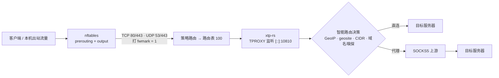

<div align="center">

# xtp-rs

**基于 Linux TPROXY 的高性能透明代理 / 端口转发工具**

[](./LICENSE)
[](https://github.com/hrimfaxi/xtp-rs/actions/workflows/release.yml)
[](https://github.com/hrimfaxi/xtp-rs/releases)
[](./Cargo.toml)

将所有入站 TCP / UDP 流量经由一个或多个 **SOCKS5** 上游转发，
支持 **GeoIP2 / geosite / 自定义 CIDR / 本地地址** 智能分流、
**TLS · HTTP · QUIC 域名嗅探**、**动态上游评分** 与 **热重载**。

</div>

---

## 📚 文档

| 文档 | 内容 |
|------|------|
| 📖 [实战教程](./docs/xtp-rs实战教程.md) | 由浅入深：从零到生产的完整指南（分流、嗅探、多上游竞争、YouTube / Poe 专线、IPv4 / IPv6 双栈） |
| 🧠 [工作原理](./docs/工作原理.md) | 整体架构、路由优先级、TCP / UDP 处理流程、动态评分机制 |
| ⚙️ [配置参考](./docs/配置.md) | 全部 TOML 配置项、默认值与校验规则 |
| 🐧 [通用 Linux 部署](./docs/部署.md) | `sudo` + nftables + 策略路由 + systemd |
| 📦 [OpenWrt 部署](./docs/OpenWrt.md) | OpenWrt 专项：`uci`、procd、ujail、交叉编译、stats-reporter |

---

## ✨ 特性

| 能力 | 说明 |
|------|------|
| 🔁 **透明代理（TPROXY）** | IPv4 / IPv6 双栈，TCP 与 UDP 流量全量拦截转发，客户端零配置 |
| 🧭 **智能路由** | 按 GeoIP2 国家归属（MaxMind MMDB）、geosite 域名分类、自定义 CIDR、本地地址类型自动判定直连 / 代理；支持域名强制规则（`force_direct_domains` / `force_socks5_domains`）覆盖 geosite 与 IP 规则 |
| 📡 **多 SOCKS5 上游** | 配置多个上游服务器，支持用户名 / 密码认证、分组路由与增益系数 |
| 📈 **动态上游评分** | 基于 `TCP_INFO` 实时吞吐监控与 QUIC 探针（RTT / 丢包率 / MTU）报告综合评分，平方加权随机选择最优上游；支持跨链路相对归一化评分与冷启动加速；粘性切换容忍度避免频繁抖动 |
| 👃 **域名嗅探** | TLS SNI（HTTPS）、HTTP Host（明文 HTTP）、QUIC SNI（QUIC Initial）三种协议嗅探；默认关闭，按需开启 |
| ⚙️ **端口转发** | 将本地 TCP / UDP 端口强制经 SOCKS5 转发到指定目标（可用于 DNS over SOCKS5 等） |
| 🔄 **热重载** | `SIGHUP` 重载配置无需重启；`SIGUSR1` 在 smart → global → bypass 间循环切换代理模式 |
| 🧹 **健康检查** | 可选主动健康检查（HTTP HEAD）结合被动性能监控，自动隔离故障上游 |
| 🧵 **半关闭回收** | TCP relay 对端只关闭写半边后长期静默时主动回收（发 RST），避免 fd / conntrack 慢性泄漏（`half_close_timeout`，默认 600 秒） |
| 🔀 **客户端路由** | 按客户端源 IP（可叠加域名或目的 IP 模式）分配不同 upstream 分组 |
| 📦 **一键部署** | 提供 `setup-xtp-rs.sh` / `unsetup-xtp-rs.sh` 脚本，快速完成 nftables + 策略路由配置 |

---

## 📦 安装与构建

### 环境要求

- **运行环境**：Linux 内核（需启用 `TPROXY`、`IP_TRANSPARENT`、`NF_SOCKET` 等选项）
- **构建环境**：Rust 1.85+（edition 2024）

### 方式一：下载预编译二进制

[GitHub Releases](https://github.com/hrimfaxi/xtp-rs/releases) 提供 x86_64 / i686 / aarch64 / armv7 / mips(el) / mips64 等多平台预编译二进制（glibc 与 musl 两种版本，musl 静态版本适合 OpenWrt 等嵌入式环境）。

### 方式二：从源码构建

```bash
git clone https://github.com/hrimfaxi/xtp-rs.git
cd xtp-rs

# 默认启用全部 sniff 功能与 geosite 支持
cargo build --release

# 按需裁剪 feature 以减小体积（例如禁用 QUIC sniff）
cargo build --release --no-default-features --features "sniff-tls,sniff-http,geosite"
```

### 方式三：OpenWrt

软件包仓库：[openwrt-xtp-rs](https://github.com/hrimfaxi/openwrt-xtp-rs)；交叉编译与安装细节见 [OpenWrt 部署](./docs/OpenWrt.md)。

### 编译 Features

| Feature | 说明 |
|---------|------|
| `sniff-tls` | TLS SNI 嗅探（默认启用） |
| `sniff-http` | HTTP Host 嗅探（默认启用） |
| `sniff-quic` | QUIC SNI 嗅探（默认启用） |
| `geosite` | geosite.dat 分流支持（默认启用） |

> 编译未开启某个 sniff feature 但配置中启用了对应嗅探时，启动会给出警告（不是编译错误）。

---

## 🚀 快速开始（Linux 通用）

> 本节命令适用于通用 Linux（Debian / Ubuntu / 软路由等），使用 `sudo`。**OpenWrt 请改用 [OpenWrt 部署](./docs/OpenWrt.md) 的 `uci` / `/etc/init.d` 命令。**

### 1. 部署透明代理环境

`contrib/usr/libexec/xtp-rs/` 下提供 `setup-xtp-rs.sh`（配置 nftables + 策略路由）、`unsetup-xtp-rs.sh`（清理）、`common.sh`（公共库）等脚本：

```bash
cd contrib/usr/libexec/xtp-rs

# 配置透明代理环境（路由表、策略路由、nftables 规则）
sudo ./setup-xtp-rs.sh

# 启动 xtp-rs（另开终端或后台运行）
sudo xtp-rs -c /etc/xtp-rs/config.toml

# 停止 xtp-rs 后清理环境
sudo ./unsetup-xtp-rs.sh
```

脚本会自动配置路由表 `100`、`fwmark 1` 策略规则、nftables 表 `inet xtp-rs`，并为 xtp-rs 的出站连接打 `fwmark 2` 防止环路。

> [!WARNING]
> 配置中的 `fwmark` 必须与脚本的 `XTP_BYPASS_MARK` 一致，默认均为 `2`，且不得与 nftables 打标用的 `XTP_FWMARK`（默认 `1`）相同。配置错误可能使程序自身的出站流量被再次截获，形成代理环路，导致相关连接无法正常建立。
>
> 可调参数（端口、保留网段、中国大陆 IP 直连等）见 [通用 Linux 部署](./docs/部署.md) 与 [OpenWrt 部署](./docs/OpenWrt.md)。

### 2. 编写配置文件

默认配置文件路径为 `config.toml`（可用 `-c` 指定）。最小化示例：

```toml
# config.toml
listen = "[::]:10810"
mmdb_path = "/path/to/GeoLite2-Country.mmdb"

[[upstream]]
id = "your_socks5_server"
addr = "127.0.0.1:20808"

[[port_forward]]
bind = "127.0.0.1:5353"
remote = "8.8.8.8:53"
network = "udp"
```

包含全部可选项的完整模板见 [contrib/etc/xtp-rs/config.toml](./contrib/etc/xtp-rs/config.toml)，逐项说明见 [配置参考](./docs/配置.md)。

### 3. 运行

```bash
# 校验配置并打印生效配置（类似 sshd -T），检查通过后退出
xtp-rs -T -c /etc/xtp-rs/config.toml

# 正式启动
sudo xtp-rs -c /etc/xtp-rs/config.toml
```

### 4. 信号控制

| 信号 | 行为 |
|------|------|
| `SIGHUP` | 热重载配置文件 |
| `SIGUSR1` | 循环切换代理模式（smart → global → bypass → smart） |
| `SIGTERM` / `SIGINT` | 优雅退出 |

---

## 🧠 工作原理速览



在 `smart` 模式下，路由决策按优先级命中即返回：**域名强制规则 → geosite → 路由缓存 → IP 强制规则 → 本地地址 / GeoIP**。完整流程（含 TCP / UDP 嗅探差异、上游动态评分机制）见 **[工作原理](./docs/工作原理.md)**。

---

## 📂 目录结构

```text
xtp-rs/
├── docs/                               # 文档
│   ├── 配置.md                          # 完整配置参考
│   ├── 工作原理.md                       # 架构与流程
│   ├── 部署.md                          # 通用 Linux 部署
│   ├── OpenWrt.md                      # OpenWrt 部署
│   └── xtp-rs实战教程.md                 # 实战教程
├── contrib/
│   ├── etc/                            # config.toml 模板、init.d / systemd、capabilities
│   └── usr/libexec/xtp-rs/             # setup / unsetup / update-chnroute / stats_reporter
├── scripts/
│   └── test_socks5_udp.py              # UDP 测试脚本
├── src/
│   ├── cli.rs                          # 命令行与配置结构
│   ├── state.rs                        # 全局状态与路由决策
│   ├── tcp.rs / udp/                   # TCP / UDP 透明代理
│   ├── sniff/                          # 协议嗅探（tls / http / quic）
│   ├── upstream.rs                     # 上游评分与选择
│   └── socks5.rs / socket_factory.rs   # SOCKS5 客户端与 socket 创建
├── Cargo.toml
└── README.md
```

---

## 🧪 测试

```bash
cargo test
```

部分测试需要 `tokio` 运行时环境（会自动处理）。

`src/activity_stream.rs` 的半关闭看门狗单测依赖 `tokio` 的 `test-util`（暂停时钟，位于 `[dev-dependencies]`，不进入发布二进制）。TCP relay 半关闭回收的集成测试使用真实 loopback socket，**不需要 root 或 TPROXY**，机制与用例见 [工作原理 · TCP relay 半关闭静默超时](./docs/工作原理.md#六tcp-relay-半关闭静默超时)。

---

## ⚠️ 注意事项

1. **权限要求** — 透明代理需要 root 权限（或 `CAP_NET_ADMIN` + `CAP_NET_RAW` + `CAP_NET_BIND_SERVICE`）。
2. **splice 零拷贝** — 默认关闭。历史讨论曾报告部分开启 IP 转发的环境存在性能下降，但不宜直接推广到所有环境；如需启用，建议在实际环境中对比吞吐量与 CPU 占用。
3. **fwmark 不要配错** — 见上文快速开始的警告；配置错误可能形成代理环路。
4. **配置校验** — 默认读取当前工作目录下的 `config.toml`，可用 `-c` 指定；`xtp-rs -T` 可在启动前校验配置。
5. **热重载限制** — `SIGHUP` 重载时，端口转发监听地址若改变会先关旧 socket 再绑新地址，频繁变动可能短暂失败。

更多排障见 [实战教程 · 排障 FAQ](./docs/xtp-rs实战教程.md#第-11-章-排障-faq)。

---

## 📄 许可证

本项目使用 **GPL-3.0** 许可证，详见 [LICENSE](./LICENSE)。

## 🙏 致谢

- [tokio](https://tokio.rs/) — 异步运行时
- [maxminddb](https://github.com/oschwald/maxminddb-rust) — GeoIP2 解析
- [iptrie](https://crates.io/crates/iptrie) — IP 前缀匹配
- [geosite-rs](https://github.com/hrimfaxi/geosite-rs) — Geosite 解析
- [socket2](https://github.com/rust-lang/socket2) — 底层 socket 操作

---

<div align="center">

**欢迎提交 Issue 和 PR！**

</div>
