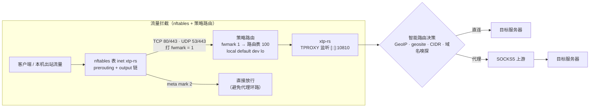
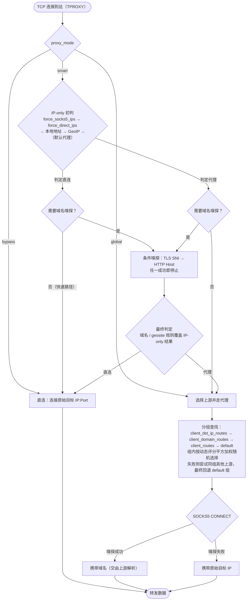
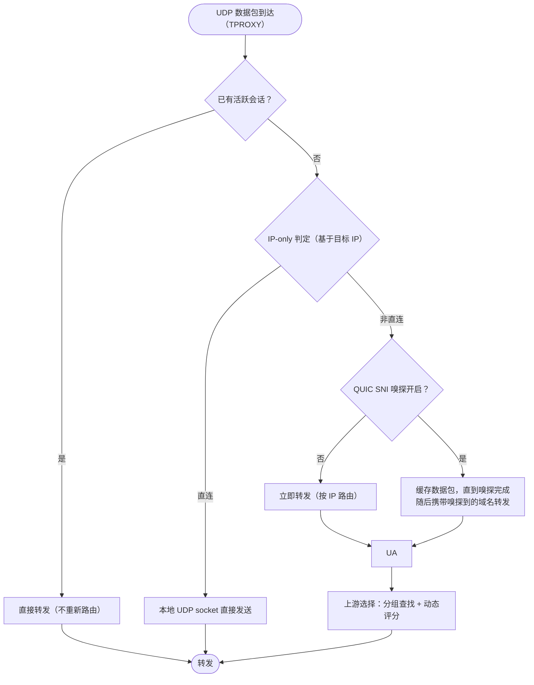

<div align="center">

# xtp-rs

**基于 Linux TPROXY 的高性能透明代理 / 端口转发工具**

[](./LICENSE)
[](https://github.com/hrimfaxi/xtp-rs/actions/workflows/release.yml)
[](https://github.com/hrimfaxi/xtp-rs/releases)
[](./Cargo.toml)

将所有入站 TCP/UDP 流量经由一个或多个 **SOCKS5** 上游转发，
支持 **GeoIP2 / geosite / 自定义 CIDR / 本地地址** 智能分流、
**TLS · HTTP · QUIC 域名嗅探**、**动态上游评分** 与 **热重载**。

📖 **[xtp-rs 实战教程](./xtp-rs实战教程.md)** — 从零到生产的完整指南：透明代理部署、GeoIP/geosite 分流、域名嗅探、多上游动态竞争（BBR vs Brutal）、YouTube/Poe 专线、IPv4/IPv6 双栈全覆盖

</div>

---

## 📑 目录

- [✨ 特性](#-特性)
- [📦 安装与构建](#-安装与构建)
- [🚀 快速开始](#-快速开始)
- [🧠 工作原理](#-工作原理)
- [⚙️ 配置参考](#️-配置参考)
- [📂 目录结构](#-目录结构)
- [🧪 测试](#-测试)
- [⚠️ 注意事项](#️-注意事项)
- [📄 许可证](#-许可证)
- [🙏 致谢](#-致谢)

---

## ✨ 特性

| 能力 | 说明 |
|------|------|
| 🔁 **透明代理（TPROXY）** | IPv4 / IPv6 双栈，TCP 与 UDP 流量全量拦截转发，客户端零配置 |
| 🧭 **智能路由** | 按 GeoIP2 国家归属（MaxMind MMDB）、geosite 域名分类、自定义 CIDR、本地地址类型自动判定直连 / 代理；支持域名强制规则（`force_direct_domains` / `force_socks5_domains`）覆盖 geosite 与 IP 规则 |
| 📡 **多 SOCKS5 上游** | 配置多个上游服务器，支持用户名 / 密码认证、分组路由与增益系数 |
| 📈 **动态上游评分** | 基于 `TCP_INFO` 实时吞吐监控与 QUIC 探针（RTT / 丢包率 / MTU）报告综合评分，平方加权随机选择最优上游；支持跨链路相对归一化评分与冷启动加速（新上游立即参与竞争）；粘性切换容忍度避免频繁抖动 |
| 👃 **域名嗅探** | TLS SNI（HTTPS）、HTTP Host（明文 HTTP）、QUIC SNI（QUIC Initial）三种协议嗅探；默认关闭，按需开启 |
| ⚙️ **端口转发** | 将本地 TCP/UDP 端口强制经 SOCKS5 转发到指定目标（可用于 DNS over SOCKS5、远程访问等） |
| 🔄 **热重载** | `SIGHUP` 重载配置无需重启；`SIGUSR1` 在 smart → global → bypass 间循环切换代理模式 |
| 🧹 **健康检查** | 可选主动健康检查（HTTP HEAD）结合被动性能监控，自动隔离故障上游 |
| 🔀 **客户端路由** | 按客户端源 IP（可叠加域名模式）分配不同 upstream 分组，实现精细化流量管理 |
| 📦 **一键部署** | 提供 `setup-xtp-rs.sh` / `unsetup-xtp-rs.sh` 脚本，快速完成 nftables + 策略路由配置 |

---

## 📦 安装与构建

### 环境要求

- **运行环境**：Linux 内核（需启用 `TPROXY`、`IP_TRANSPARENT`、`NF_SOCKET` 等选项）
- **构建环境**：Rust 1.85+（edition 2024）

### 方式一：下载预编译二进制

[GitHub Releases](https://github.com/hrimfaxi/xtp-rs/releases) 提供 x86_64 / i686 / aarch64 / armv7 / mips(el) / mips64 等多平台预编译二进制（glibc 与 musl 两种版本，musl 静态版本适合 OpenWrt 等嵌入式环境）。

### 方式二：从源码构建

```bash
git clone https://github.com/hrimfaxi/xtp-rs.git
cd xtp-rs

# 默认启用全部 sniff 功能与 geosite 支持
cargo build --release

# 按需裁剪 feature 以减小体积（例如禁用 QUIC sniff）
cargo build --release --no-default-features --features "sniff-tls,sniff-http,geosite"
```

### 方式三：OpenWrt 编译安装

OpenWrt 软件包 Makefile 仓库：[openwrt-xtp-rs](https://github.com/hrimfaxi/openwrt-xtp-rs)

### 编译 Features

| Feature | 说明 |
|---------|------|
| `sniff-tls` | TLS SNI 嗅探（默认启用） |
| `sniff-http` | HTTP Host 嗅探（默认启用） |
| `sniff-quic` | QUIC SNI 嗅探（默认启用） |
| `geosite` | geosite.dat 分流支持（默认启用） |

---

## 🚀 快速开始

### 1. 部署透明代理环境

项目 `contrib/usr/libexec/xtp-rs/` 目录下提供了四个辅助脚本：

| 脚本 | 作用 |
|------|------|
| `common.sh` | 公共函数库，供其他脚本引用 |
| `setup-xtp-rs.sh` | 一键配置 nftables 规则和策略路由（需 root 权限） |
| `unsetup-xtp-rs.sh` | 一键清理上述规则 |
| `update-chnroute.sh` | 更新中国大陆 IPv4 直连列表（可选，配合 UCI 选项 `bypass_chnroute`） |

```bash
cd contrib/usr/libexec/xtp-rs

# 配置透明代理环境（路由表、策略路由、nftables 规则）
sudo ./setup-xtp-rs.sh

# 启动 xtp-rs（另开终端或后台运行）
sudo xtp-rs -c /etc/xtp-rs/config.toml

# 停止 xtp-rs 后清理环境
sudo ./unsetup-xtp-rs.sh
```

> [!IMPORTANT]
> `setup-xtp-rs.sh` 会自动配置：
> - 路由表 ID `100`，添加 `local default dev lo` 路由；
> - 策略规则：`fwmark 1` 查找路由表 `100`；
> - nftables 表 `inet xtp-rs`：在 `prerouting` 链（转发的入站流量）和 `output` 链（本机出站流量）中匹配 TCP 80/443 与 UDP 53/443，**打 `fwmark = 1`** 使其走策略路由；
> - xtp-rs 自身出站连接设置 `SO_MARK = 2`（`XTP_BYPASS_MARK`），nftables 遇 `meta mark 2` 直接放行，**避免代理流量被再次劫持形成环路**。
>
> 如需修改默认端口或 fwmark，可编辑 `common.sh` 中的 `XTP_TPROXY_PORT`、`XTP_FWMARK`、`XTP_BYPASS_MARK` 变量。

#### 可选：中国大陆 IP 直连（UCI 选项 `bypass_chnroute`）

TPROXY 会把被截获的流量导入本机 input 路径，这些流永远到不了 forward hook，
因此 **fw4 flowtable 软/硬 offload 对被代理流量无效**。开启本选项后，目的地址
命中中国大陆 IPv4 列表的流量在 prerouting/output 中提前直连放行：国内流量
不再被代理（更低延迟与 CPU 开销），且重新走 FORWARD 路径，offload 得以生效。

```bash
# 1. 下载并生成列表（需能访问 GitHub，或用 XTP_CHNROUTE_URL 指定镜像）
sudo ./update-chnroute.sh

# 2. 开启开关（OpenWrt UCI；默认配置文件见 contrib/etc/config/xtp-rs）
uci set xtp-rs.main.bypass_chnroute='1'
uci commit xtp-rs

# 3. 应用规则（或 /etc/init.d/xtp-rs restart）
sudo ./setup-xtp-rs.sh

# 4. 建议加入 cron 定期刷新列表（每周一两次即可）
#    30 4 * * 0,3 /usr/libexec/xtp-rs/update-chnroute.sh >/dev/null 2>&1
```

说明：
- 列表文件位于 `/etc/xtp-rs/chnroute.nft`，仅 IPv4；更新后需重跑 `setup-xtp-rs.sh` 生效；
- 文件缺失时 setup 仅告警并继续，不影响其余功能；
- 开关取值优先级：环境变量 `XTP_BYPASS_CHNROUTE` > UCI 选项 > 默认关闭。
  非 OpenWrt 环境（无 uci）直接用环境变量即可。

### 2. 编写配置文件

默认配置文件路径为 `config.toml`（可通过 `-c` 指定）。最小化示例：

```toml
# config.toml
listen = "[::]:10810"
mmdb_path = "/path/to/GeoLite2-Country.mmdb"

[[upstream]]
id = "your_socks5_server"
addr = "127.0.0.1:20808"

[[port_forward]]
bind = "127.0.0.1:5353"
remote = "8.8.8.8:53"
network = "udp"
```

包含全部可选项的完整模板见 [contrib/etc/xtp-rs/config.toml](./contrib/etc/xtp-rs/config.toml)。

### 3. 运行

```bash
# 校验配置并打印生效配置（类似 sshd -T），检查通过后退出
xtp-rs -T -c /etc/xtp-rs/config.toml

# 正式启动
sudo xtp-rs -c /etc/xtp-rs/config.toml
```

### 4. 信号控制

| 信号 | 行为 |
|------|------|
| `SIGHUP` | 热重载配置文件 |
| `SIGUSR1` | 循环切换代理模式（smart → global → bypass → smart） |
| `SIGTERM` / `SIGINT` | 优雅退出 |

---

## 🧠 工作原理

### 整体架构



> [!WARNING]
> **fwmark 约定**：`fwmark = 1`（`XTP_FWMARK`）由 nftables 设置，标记“待代理”的入站流量；`fwmark = 2`（`XTP_BYPASS_MARK`）由 xtp-rs 设置，标记“已代理 / 直连”的出站流量。因此配置文件中的 `fwmark` **必须为 2**，绝不能与 `XTP_FWMARK` 相同，否则程序自身的请求会被再次劫持形成环路。

### 路由优先级

在 `smart` 模式下，路由决策按以下优先级从高到低执行（命中即返回）：

1. **域名强制规则** — `force_socks5_domains` → `force_direct_domains`
2. **geosite 域名分类** — `proxy_geosite_tags` → `direct_geosite_tags`
3. **路由缓存** — 缓存由 IP 规则和 GeoIP 得出的结果（域名规则不写缓存）
4. **IP 强制规则** — `force_socks5_ips` → `force_direct_ips`
5. **本地地址** — `direct_local_ip` 控制的回环 / 链路本地地址
6. **GeoIP 国家判定** — `direct_countries` 中的国家代码

域名规则支持两种格式：

| 格式 | 匹配方式 |
|------|----------|
| `.example.com` | 后缀匹配：匹配 `example.com` 及其所有子域名 |
| `example.com` | 精确匹配：仅匹配 `example.com` |

> [!TIP]
> 例如排除 PlayStation 流量不走代理：
>
> ```toml
> force_direct_domains = [".playstation.com", ".sony.com", ".playstation.net"]
> ```

### TCP 连接处理流程



**触发域名嗅探的条件**（满足任一即需要）：

- 配置了域名强制规则（`force_direct_domains` 或 `force_socks5_domains` 非空）；
- 配置了 geosite 且处于 `smart` 模式；
- 配置了 `client_domain_routes` 且当前客户端 IP 命中其中的 CIDR。

**路由结果缓存**：由 IP 规则与 GeoIP 得出的路由结果会写入缓存（TTL 由 `route_cache_ttl_secs` 控制，容量由 `route_cache_max` 控制），后续相同目标的连接直接复用；域名规则的结果不写缓存。

### UDP 数据包处理流程



> [!NOTE]
> **TCP 与 UDP 嗅探的关键差异**：TCP 嗅探结果会参与**直连 / 代理决策**（通过 geosite / 域名规则）；UDP 嗅探结果仅影响**上游分组选择**，直连 / 代理判定始终基于 IP-only 结果。

---

## ⚙️ 配置参考

### 核心参数

| 参数 | 类型 | 默认值 | 说明 |
|------|------|--------|------|
| `listen` | string | `"[::]:10810"` | TPROXY 监听地址（需与部署脚本中的端口一致） |
| `udp` | bool | `true` | 是否启用 UDP 转发 |
| `fwmark` | u32 | `2` | 直连 / SOCKS5 出站 socket 使用的 fwmark（必须与脚本中的 `XTP_BYPASS_MARK` 一致，见上文警告） |
| `socks5_user` | string | 无 | SOCKS5 认证用户名（需与 `socks5_password` 同时配置） |
| `socks5_password` | string | 无 | SOCKS5 认证密码（需与 `socks5_user` 同时配置） |
| `mmdb_path` | string | 无 | GeoIP2 Country 数据库路径（留空禁用国家判定） |
| `direct_countries` | [string] | `["CN"]` | 直连的国家代码（ISO 3166-1 alpha-2） |
| `force_socks5_ips` | [string] | `[]` | 强制走代理的 IP/CIDR（IP 规则中最高优先级） |
| `force_direct_ips` | [string] | `[]` | 强制直连的 IP/CIDR（优先级低于 force_socks5） |
| `force_socks5_ips_file` | string | 无 | 额外的强制 SOCKS5 IP/CIDR 文件路径（每行一个） |
| `force_direct_ips_file` | string | 无 | 额外的强制直连 IP/CIDR 文件路径（每行一个） |
| `force_socks5_domains` | [string] | `[]` | 强制走代理的域名（域名规则中优先级最高） |
| `force_direct_domains` | [string] | `[]` | 强制直连的域名（优先级高于 geosite，低于 force_socks5_domains） |
| `direct_local_ip` | bool | `true` | 回环 / 链路本地地址是否强制直连 |
| `sniff_tls_sni` | bool | `false` | 是否启用 TLS SNI 嗅探（仅非直连 TCP） |
| `sniff_http_host` | bool | `false` | 是否启用 HTTP Host 嗅探 |
| `quic_sniff_mode` | string | `"none"` | QUIC SNI 嗅探档位：`none` / `besteffort` / `full` |
| `proxy_mode` | string | `"smart"` | 代理模式：`smart` / `global` / `bypass` |
| `geosite_path` | string | 无 | geosite.dat 文件路径（需编译 geosite feature） |
| `proxy_geosite_tags` | [string] | `[]` | 走代理的 geosite 分类（如 `gfw`） |
| `direct_geosite_tags` | [string] | `[]` | 走直连的 geosite 分类（如 `geolocation-cn`） |
| `log_level` | string | 环境变量，否则 `info` | 日志级别：`error` / `warn` / `info` / `debug` / `trace` |
| `udp_session_timeout_secs` | u64 | `60` | UDP 会话空闲超时时间（秒） |
| `connect_timeout_secs` | u64 | `20` | 上游连接超时时间（秒） |
| `splice` | bool | `false` | TCP 转发是否优先使用 splice 零拷贝 |
| `route_cache_ttl_secs` | u64 | `5` | 路由结果缓存 TTL（秒），0 禁用缓存 |
| `route_cache_max` | usize | `4096` | 路由结果缓存最大条目数 |

> [!NOTE]
> 嗅探功能默认均为关闭，需手动开启。编译时默认包含所有嗅探代码，运行时开启不会带来额外性能损失（仅处理非直连流量的首包）。

### 上游动态评分

| 参数 | 类型 | 默认值 | 说明 |
|------|------|--------|------|
| `disable_upstream_score` | bool | `false` | 禁用上游动态评分（启用后完全随机选择） |
| `upstream_switch_tolerance` | u32 | `0` | 粘性切换容忍度（分），0 表示不启用粘性 |
| `quic_weight` | u32 | `40` | QUIC 探针在选路分数中的权重（0-100） |
| `quic_stale_secs` | u64 | `180` | QUIC 探针分数过期阈值（秒），超期后线性衰减到最低分（10） |
| `enable_relative_scoring` | bool | `false` | 启用跨链路相对归一化评分（见下方说明） |
| `relative_rescore_interval_secs` | u64 | `2` | 相对归一化评分重算间隔（秒），仅相对模式生效 |
| `upstream_score_debug_interval_secs` | u64 | `0` | 分数调试打印间隔（秒），仅在 debug 级别启用时生效，设置为 0 禁用 |

**评分机制说明**（默认绝对分段模式）：

- **TCP 分数**：基于 `TCP_INFO` 实时吞吐量（bytes_received + bytes_acked），每 2 秒采样更新，采用 50/50 历史与新数据混合。
- **QUIC 分数**：基于 ShadowQUIC 探针报告的 RTT、丢包率、MTU 综合计算，采用 30/70 历史与新数据混合，支持上行/下行双链路独立评分。
- **QUIC 衰减**：QUIC 探针分数在 `quic_stale_secs`（默认 180 秒）未更新后线性衰减到最低分（10 分），避免因探针断流导致 upstream 被"饿死"而无法被选中更新。
- **综合评分**：最终分数 = TCP 分数 × (100 - quic_weight) + QUIC 分数 × quic_weight，任一分数无效时退化为另一方；两路都无效时按基础分 75 处理。
- **惩罚与基础分**：新 upstream 与连接失败被惩罚的 upstream 统一使用基础分 75，有效分下限 1 保证所有 upstream 都有机会被选中。
- **选路权重**：effective_score = score × gain，采用平方加权随机选择（高分优势放大）。

**相对归一化模式**（`enable_relative_scoring = true`，默认关闭）：

绝对分段模式按固定吞吐阈值（≥50 MiB/s = 1000 分）打分，光纤链路稳定拿满分，4G/卫星链路被压得抬不起头。相对模式把吞吐速率与探针质量**相对同组最大值**归一化到 0~1000，自动适配任意网络环境：

- 每个 `relative_rescore_interval_secs`（默认 2 秒）跨链路重算一次：组内最快/最优的链路得满分，其余按比例得分，评分口径与绝对量纲无关。
- **冷启动种子**：尚无吞吐样本的新链路用探针相对分预置初始分；连探针报告都拿不到（新链路还没分到流量，ShadowQUIC 只在有流量时上报）时，用组内最优的一半做乐观先验，避免「无样本 → 无分数 → 无流量」的饥饿死锁。
- **未初始化探索**：存在无任何测量样本的上游时，选路以 5% 概率从中均匀选取，保证新链路必能分到流量产生样本（对绝对模式同样生效）。
- 坏链路成本有上限：连接失败即惩罚到基础分 75 并标记为已测量，探索与种子立即停止向它倾斜。

### xtp-stats-reporter（ShadowQUIC 性能上报 daemon）

`xtp-stats-reporter` 是一个 **ShadowQUIC 专用**的性能上报 daemon，运行在 OpenWrt 路由器上。ShadowQUIC 原生支持将链路质量（RTT、丢包率、MTU）输出到 syslog，xtp-stats-reporter 从 syslog 中实时捕获这些日志，解析后通过本地 Unix 数据报 socket（`/tmp/xtp-rs-report.sock`）以 JSON 格式上报给 xtp-rs，供上游动态评分使用。无需对 ShadowQUIC 做任何修改。

**工作流程**：


**部署**：

```bash
# 安装到 OpenWrt
cp contrib/etc/init.d/xtp-stats-reporter /etc/init.d/
cp contrib/usr/libexec/xtp-rs/stats_reporter.sh /usr/libexec/xtp-rs/
chmod +x /etc/init.d/xtp-stats-reporter /usr/libexec/xtp-rs/stats_reporter.sh

# 启用并启动
/etc/init.d/xtp-stats-reporter enable
/etc/init.d/xtp-stats-reporter start
```

**依赖**：`socat`（用于发送 Unix 数据报）、`logread`（OpenWrt 自带）。

**上报 JSON 格式**：

```json
{"upstream_id": "bbr_tunnel", "peer": "1234", "rtt_ms": 152.300, "loss_rate": 0.3700, "mtu": 1280, "link": "downlink"}
```

| 字段 | 说明 |
|------|------|
| `upstream_id` | 从 ShadowQUIC 的 `-c` / `--config` 参数推导的实例名（配置文件名去扩展名，见下例） |
| `peer` | ShadowQUIC 进程 PID |
| `rtt_ms` | 链路 RTT（毫秒） |
| `loss_rate` | 丢包率（小数，0.37 = 37%） |
| `mtu` | 链路 MTU |
| `link` | 方向：`uplink` / `downlink` |

`upstream_id` 的推导规则：读取 `/proc/PID/cmdline`，找到 `-c` / `-c=` / `--config` / `--config=` 参数对应的路径，取 basename 并去掉扩展名。例如：

| 启动命令 | `upstream_id` |
|----------|---------------|
| `shadowquic -c /etc/shadowquic/bbr.yaml` | `bbr` |
| `shadowquic -c /etc/shadowquic/brutal.yaml` | `brutal` |
| `shadowquic --config=/etc/shadowquic/poe.yaml` | `poe` |
| 找不到 `-c` 参数 | `unknown-<PID>` |

> [!NOTE]
> xtp-stats-reporter 仅解析 ShadowQUIC 格式的 syslog 条目（匹配 `shadowquic[PID]:` 前缀 + `uplink stats` / `downlink stats` 关键字）。其他进程的日志会被忽略。

### 健康检查

| 参数 | 类型 | 默认值 | 说明 |
|------|------|--------|------|
| `health_check_interval_secs` | u64 | `0` | 主动健康检查间隔（秒），0 表示禁用 |
| `health_check_timeout_secs` | u64 | `5` | 单次健康检查超时（秒） |
| `health_check_fail_threshold` | u32 | `2` | 连续失败次数阈值 |
| `health_check_url` | string | `"cp.cloudflare.com"` | 健康检查目标 URL |

### TLS 嗅探

| 参数 | 类型 | 默认值 | 说明 |
|------|------|--------|------|
| `tcp_peek_buffer_size` | usize | `32768` | TCP 首包 sniff 全局缓冲区上限（字节） |
| `tls_sniff_peek_len` | usize | `2048` | TLS sniff 首次 peek 长度（字节） |
| `tls_sniff_max_len` | usize | `32768` | TLS sniff 最大探测长度（字节） |
| `tls_sniff_max_retries` | usize | `5` | TLS sniff 最大重试次数 |
| `tls_sniff_wait_more_ms` | u64 | `100` | TLS sniff 等待更多数据时间（毫秒） |
| `tls_sniff_timeout_ms` | u64 | `1000` | TLS sniff 总超时时间（毫秒） |

### HTTP 嗅探

| 参数 | 类型 | 默认值 | 说明 |
|------|------|--------|------|
| `http_sniff_peek_len` | usize | `512` | HTTP sniff 首次 peek 长度（字节） |
| `http_sniff_max_len` | usize | `16384` | HTTP sniff 最大探测长度（字节） |
| `http_sniff_max_retries` | usize | `5` | HTTP sniff 最大重试次数 |
| `http_sniff_wait_more_ms` | u64 | `100` | HTTP sniff 等待更多数据时间（毫秒） |
| `http_sniff_timeout_ms` | u64 | `1000` | HTTP sniff 总超时时间（毫秒） |

### 上游配置

```toml
[[upstream]]
id = "server1"                  # 唯一标识
addr = "192.168.1.100:1080"     # SOCKS5 地址
# groups = ["default"]          # 所属分组，未设置则自动属于 ["default"]
# gain = 1.0                    # 乘数因子，用于放大或缩小该 upstream 的动态分数
```

- 至少配置一个 `upstream`，可配置多个，系统会动态评分并加权随机选择；
- `gain` 必须大于 0，用于调整该 upstream 的选路权重；
- `groups` 用于配合 `client_routes` 实现分组路由。

### 客户端路由配置

```toml
# 按客户端源 IP 分配 upstream 分组
[client_routes]
"192.168.1.100" = "group_a"
"192.168.2.0/24" = "group_b"

# 按客户端源 IP + 域名模式分配 upstream 分组
# 支持两种域名匹配模式：
#   ".example.com"：后缀匹配，匹配 example.com 及其所有子域名
#   "example.com" ：精确匹配，仅匹配 example.com
[client_domain_routes."192.168.1.100"]
".google.com" = "proxy_group"    # 后缀匹配
"example.com" = "direct_group"   # 精确匹配

# 按客户端源 IP + 目的 IP/CIDR 分配 upstream 分组
# 优先级最高（高于 client_domain_routes / client_routes）
[client_dst_ip_routes."192.168.1.0/24"]
"172.253.118.0/24" = "proxy_group"
```

- `client_routes`：按客户端源 IP 分配 upstream 分组，支持单 IP 和 CIDR；
- `client_domain_routes`：按客户端源 IP + 域名模式分配分组，优先级高于 `client_routes`；
- `client_dst_ip_routes`：按客户端源 IP + 目的 IP/CIDR 分配分组，优先级最高；
- 域名匹配按后缀长度降序优先匹配，确保最长匹配优先；
- 分组查找顺序：`client_dst_ip_routes → client_domain_routes → client_routes → default`。

### 端口转发

```toml
[[port_forward]]
name = "dns-via-socks5"       # 可选，仅用于日志
bind = "127.0.0.1:5353"       # 本地监听地址
remote = "8.8.8.8:53"         # 远端目标（必须是 IP:PORT）
network = "both"              # tcp / udp / both
```

---

## 📂 目录结构

```
xtp-rs/
├── contrib/
│   ├── etc/
│   │   ├── config/xtp-rs                # OpenWrt UCI 默认配置（bypass_chnroute 等）
│   │   ├── capabilities/xtp-rs.json    # Linux capabilities 配置
│   │   ├── init.d/
│   │   │   ├── xtp-rs                  # OpenWrt init 脚本
│   │   │   └── xtp-stats-reporter      # ShadowQUIC 性能上报 daemon 的 init 脚本
│   │   └── xtp-rs/
│   │       ├── config.toml                     # 完整配置模板
│   │       └── Country-only-cn-private.mmdb    # GeoIP 数据库示例
│   └── usr/libexec/xtp-rs/
│       ├── common.sh                   # 公共函数库
│       ├── setup-xtp-rs.sh             # 透明代理环境安装脚本
│       ├── unsetup-xtp-rs.sh           # 清理脚本
│       ├── update-chnroute.sh          # 中国大陆 IPv4 直连列表更新脚本（可选）
│       └── stats_reporter.sh           # ShadowQUIC 性能上报 daemon 主脚本
├── scripts/
│   └── test_socks5_udp.py              # UDP 测试脚本
├── src/
│   ├── cli.rs                          # 命令行和配置结构
│   ├── main.rs                         # 程序入口
│   ├── sniff/                          # 协议嗅探（tls, http, quic）
│   ├── socks5.rs                       # SOCKS5 客户端实现
│   ├── socket_factory.rs               # Socket 创建工厂
│   ├── tcp.rs                          # TCP 透明代理处理
│   ├── udp/                            # UDP 会话管理与转发
│   ├── upstream.rs                     # 上游评分与选择
│   ├── state.rs                        # 全局状态与生命周期
│   └── util.rs                         # 工具函数
├── Cargo.toml
└── README.md
```

---

## 🧪 测试

```bash
cargo test
```

部分测试需要 `tokio` 运行时环境（会自动处理）。

---

## ⚠️ 注意事项

1. **权限要求** — 透明代理需要 root 权限（或 `CAP_NET_ADMIN` + `CAP_NET_RAW` + `CAP_NET_BIND_SERVICE`）。
2. **splice 零拷贝** — 若系统启用了 IP 转发（`net.ipv4.ip_forward=1`），使用 `splice` 可能导致性能下降，参见 [splice 与转发路径的注意事项](https://github.com/XTLS/Xray-core/discussions/59)。建议保持默认 `splice = false`。
3. **QUIC SNI 嗅探** — 三档（`quic_sniff_mode`，默认 `none`）：
   - `none`：不嗅探，UDP 包立即按 IP 路由转发（零延迟、零 CPU 开销）；
   - `besteffort`：只对每个流（同一目的 IP）的首包尝试提取 SNI，首包不足或失败即放弃、不再对后续包重试，无额外延迟（xray-core 默认行为）；
   - `full`：按域名分组更准。需要嗅探的 QUIC 数据包缓存在 pending 中直到嗅探出域名再转发，但会牺牲约 n*RTT 时延（仅当 ClientHello 跨多个包时缓存等待补齐，典型约 1 秒、最坏 5 秒；单包内装下的 ClientHello 仍立即转发）。
   解析 QUIC Initial 会增加 CPU 开销，可按需选择档位。
4. **配置文件路径** — 默认读取当前工作目录下的 `config.toml`，可通过 `-c` 参数指定；`xtp-rs -T` 可在启动前校验配置。
5. **热重载限制** — `SIGHUP` 重载时，端口转发监听地址若发生改变，旧地址上的监听 socket 会被关闭、新地址重新绑定；若新旧地址冲突可能导致短暂失败，建议避免频繁变动。
6. **客户端路由** — 使用 `client_routes` 和 `client_domain_routes` 时，确保引用的 upstream 分组已在 `[[upstream]]` 中配置；未配置 `groups` 的 upstream 默认属于 `default` 组。
7. **OpenWrt 部署** — 使用 `contrib/etc/init.d/xtp-rs` 脚本可集成到 OpenWrt 的 procd 服务管理，支持 ujail 沙箱和 capabilities 限制。

---

## 📄 许可证

本项目使用 **GPL-3.0** 许可证，详见 [LICENSE](./LICENSE)。

## 🙏 致谢

- [tokio](https://tokio.rs/) — 异步运行时
- [maxminddb](https://github.com/oschwald/maxminddb-rust) — GeoIP2 解析
- [iptrie](https://crates.io/crates/iptrie) — IP 前缀匹配
- [geosite-rs](https://github.com/hrimfaxi/geosite-rs) — Geosite 解析
- [socket2](https://github.com/rust-lang/socket2) — 底层 socket 操作

---

<div align="center">

**欢迎提交 Issue 和 PR！**

</div>
