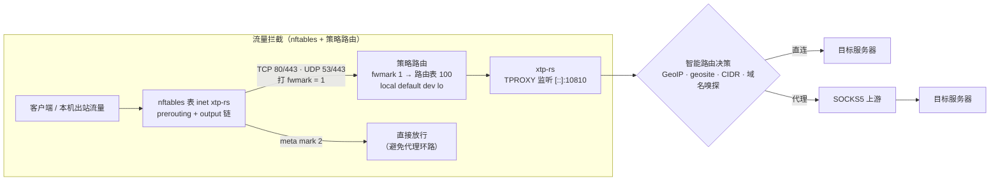
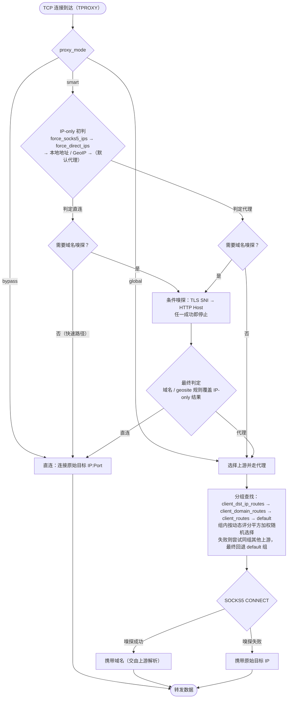
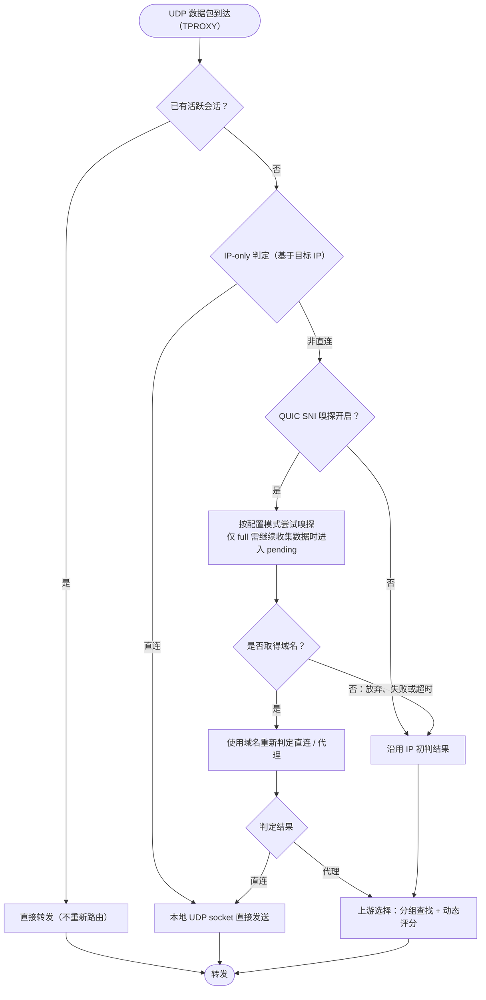

# 工作原理

> [← 返回 README](../README.md) · 相关：[配置参考](./配置.md) · [部署](./部署.md) · [OpenWrt 部署](./OpenWrt.md)

本文描述 xtp-rs 的流量走向、路由决策、上游评分与 TCP relay 半关闭回收机制。配置项含义见 [配置参考](./配置.md)。

---

## 一、整体架构



> [!WARNING]
> **fwmark 约定**：`fwmark = 1`（`XTP_FWMARK`）由 nftables 设置，标记“待代理”的入站流量；`fwmark = 2`（`XTP_BYPASS_MARK`）由 xtp-rs 设置，标记“已代理 / 直连”的出站流量。配置文件中的 `fwmark` 必须与脚本的 `XTP_BYPASS_MARK` 一致，默认均为 `2`，且不得与 `XTP_FWMARK` 相同。配置错误可能使程序自身的出站流量被再次截获，形成代理环路，导致相关连接无法正常建立。

---

## 二、路由优先级（smart 模式）

在 `smart` 模式下，路由决策按以下优先级从高到低执行（命中即返回）：

| 优先级 | 规则 | 相关配置 |
|:---:|------|----------|
| 1 | 域名强制规则 | `force_socks5_domains` → `force_direct_domains` |
| 2 | geosite 域名分类 | `proxy_geosite_tags` → `direct_geosite_tags` |
| 3 | 路由缓存 | 缓存由 IP 规则与 GeoIP 得出的结果（域名规则不写缓存） |
| 4 | IP 强制规则 | `force_socks5_ips` → `force_direct_ips` |
| 5 | 本地地址 / GeoIP 国家 | `direct_local_ip`（回环 / 链路本地）与 `direct_countries`（默认 `["CN"]`）在同一判定层 |

几个要点：

- **在取得域名并执行域名判定时，域名规则优先于 IP 规则**：例如目标 IP 属于中国大陆，但域名命中 `force_socks5_domains` 或 `proxy_geosite_tags` 时，仍会走代理；反之，域名直连规则也可以将 IP 初判的代理结果改为直连。UDP 路径存在跳过嗅探的情况，详见下文。
- **geosite 内部先 proxy 后 direct**：同一域名同时命中两边时代理胜出，所以 `direct_geosite_tags` 要保守。
- **路由缓存**：由 IP 规则与 GeoIP 得出的结果会写入缓存（TTL 由 `route_cache_ttl_secs` 控制，容量由 `route_cache_max` 控制），后续相同目标直接复用；**域名规则的结果不写缓存**（每次都现算，保证专线规则即时生效）。

域名规则支持两种格式：

| 格式 | 匹配方式 |
|------|----------|
| `.example.com` | 后缀匹配：匹配 `example.com` 及其所有子域名 |
| `example.com` | 精确匹配：仅匹配 `example.com` |

> [!TIP]
> 例如排除 PlayStation 流量不走代理：
>
> ```toml
> force_direct_domains = [".playstation.com", ".sony.com", ".playstation.net"]
> ```

---

## 三、TCP 连接处理流程



**触发域名嗅探的条件**（满足任一即需要）：

- 配置了域名强制规则（`force_direct_domains` 或 `force_socks5_domains` 非空）；
- 配置了 geosite（`geosite_path` 非空）**且** `proxy_geosite_tags` 或 `direct_geosite_tags` 非空，且处于 `smart` 模式；
- 配置了 `client_domain_routes` 且当前客户端 IP 命中其中的 CIDR（仅在 IP 初判为“非直连”时触发）。

前两类在直连与代理路径上都会嗅探，用于纠正 IP 层的误判；第三类只在需要按域名分组时才触发。若对应 sniff 功能未编译或未在配置中开启，嗅探会直接返回空结果。

---

## 四、UDP 数据包处理流程



> [!IMPORTANT]
> **TCP 与 UDP 嗅探的差异**：
> - TCP 嗅探结果参与**直连 / 代理决策**（重新按 geosite 和域名强制规则判定）。
> - UDP 嗅探结果**同样参与直连 / 代理决策**：建会话时会以嗅探到的域名调用 `should_direct(ip, domain)`，因此域名规则可以将“IP 初判代理”的判定结果改为直连；嗅探结果还会影响 SOCKS5 UDP 目标地址（用域名还是 IP）与上游分组选择。
> - 但 **IP 初判为直连的 UDP 流会短路跳过嗅探**（内网、保留地址等无需重组），因此嗅探无法将“IP 直连”的判定结果改为代理。
> - 会话建立后，所采用的路由和目标地址形式（域名或 IP）不再改变；后续数据包即使提供了新的域名信息，也不会改变该会话的路由。

QUIC 嗅探模式（`quic_sniff_mode`）见 [配置参考](./配置.md#quic-嗅探模式)。其中 `full` 模式的 pending 缓存等待时限由 `quic_sniff_pending_timeout_ms` 控制（默认 **200 ms**），仅当 ClientHello 跨包时才需要缓存等待；首包即可完成嗅探时解析后直接转发，不进入 pending。

---

## 五、上游动态评分机制

xtp-rs 给每条上游维护一个动态分，来自两个信息源，再经加权、惩罚与平方加权随机完成选路。

### 5.1 TCP 吞吐分（自动）

通过 `TCP_INFO` 周期统计每条上游 SOCKS5 连接的实际吞吐量（`bytes_received + bytes_acked`），**每 2 秒**采样一次，新旧数据按 **50/50** 混合。样本过小（低于 16 KB）时不更新，避免噪声。

### 5.2 QUIC 探针分（被动接收）

ShadowQUIC 把链路质量（RTT、丢包率、MTU）输出到 syslog，`xtp-stats-reporter` 捕获后经 Unix 数据报 socket 上报（部署见 [OpenWrt 部署](./OpenWrt.md#五xtp-stats-reporter-shadowquic-性能上报)）。分数由 RTT / 丢包率 / MTU 综合计算，新旧按 **30/70** 混合（新数据占七成，响应快又不至于抖动），上行 / 下行链路独立评分；探针分更新有 5 秒冷却。

### 5.3 衰减与合成

- **衰减**：QUIC 探针分数在 `quic_stale_secs`（默认 180 秒）未更新后**线性衰减到最低分 10**，避免探针断流导致上游长期无法被选中。
- **合成**：`总分 = TCP 分 × (100 - quic_weight)% + QUIC 分 × quic_weight%`（`quic_weight` 默认 40）。任一分数无效时退化为另一方；两路都无效时按**基础分 75**。
- **惩罚与基础分**：新上游与连接失败被惩罚的上游统一使用基础分 75，有效分下限为 1，保证所有上游都有机会被选中。健康检查恢复后会把该上游的 TCP 分重置为 300。
- **选路权重**：`有效分 = 总分 × gain`，采用**平方加权随机**选择（`权重 = 有效分²`，高分优势放大），但权重有上限以保留探索空间。

### 5.4 相对归一化模式

`enable_relative_scoring = true`（默认关闭）时，评分口径从“绝对阈值分段”改为“跨链路相对归一化”，适配光纤 / 4G / 卫星等异构网络：

- 每 `relative_rescore_interval_secs`（默认 2 秒）重算一次：把每条上游的吞吐速率与探针质量相对**同组最大值的指数移动平均（EMA）** 归一化到 0~1000，组内最优得满分，其余按比例得分。
- **冷启动种子**：尚无吞吐样本的新链路用探针相对分预置初始分；连探针报告都拿不到时，用组内最优的一半做乐观先验。
- **未初始化探索**：存在无任何测量样本的上游时，选路以 5% 概率从中均匀选取，保证新链路必能分到流量产生样本。
- 坏链路成本有上限：连接失败即惩罚到基础分 75 并标记为已测量，探索与种子立即停止向它倾斜。

---

## 六、TCP relay 半关闭静默超时

`copy_bidirectional` 只在**两个方向都读到 EOF** 后才返回。若对端只关闭写半边（half-close）后永不关闭读半边，relay 会永久挂起，连接长期停留在 `CLOSE-WAIT` / `FIN-WAIT-2`，慢性泄漏 fd、内核 socket、conntrack 表项与 ephemeral port。

`half_close_timeout`（默认 600 秒，`0` 禁用）为该场景兜底：**一方已半关闭**，且此后双向静默超过该时长时，主动回收会话。

| 行为 | 说明 |
|------|------|
| 触发条件 | 必须先有半关闭（某个方向读到 EOF 后关闭对向写半边） |
| 计时起点 | 第一次半关闭的时刻，不是连接建立时刻 |
| 计时重置 | 半关闭后转发层仍有进展（relay 成功读出或写入字节）就重新计时 |
| 空闲长连接 | 双方都未半关闭时**不**触发，交互式登录等正常空转不受影响 |
| 关闭方式 | 两侧 socket 设 `SO_LINGER=0` 后 drop，直接发 **RST**（避免 FIN 无人 ACK 再挂一段） |
| 禁用 | `half_close_timeout = 0`，行为与未引入该机制时一致（可用于回滚验证） |
| 生效前提 | `splice = false` |
| RST 范围 | 仅看门狗触发这一条路径；普通转发 I/O 错误不额外发 RST |

> [!NOTE]
> “静默”的判定依据是 relay 自身的转发进展（一个方向成功读出、或对向成功写入字节），不是“内核接收缓冲里还有数据”。若某一端停止读取造成反压、转发层无法推进，即使对端仍在发包，超过 `half_close_timeout` 仍会被回收——此时连接确实已经没有端到端进展。

> [!IMPORTANT]
> `splice = true` 时**看门狗不生效**：zero-copy 由内核在 fd 之间搬运数据，不经过 `poll_read` / `poll_write`，看门狗依赖的活动观测无法工作。xtp-rs 不会静默改掉用户显式开启的优化，而是在启动与 `SIGHUP` 热重载时各 **WARN 一次**，提示 `half_close_timeout` 已被忽略。需要该保护请设 `splice = false`。

### 日志与计数器

每次看门狗触发输出一条 `WARN`（不做采样，便于据日志反推回收速率）：

```text
WARN TCP relay half-closed and silent, session reclaimed with RST
     target=1.2.3.4:443 upstream_id=u1 silent_secs=600 duration_ms=3600000 total=17
```

字段：`target`（原始目标）、`upstream_id`（可选）、`silent_secs`（静默时长）、`duration_ms`（连接总时长）、`total`（累计触发次数）。

xtp-rs 没有可抓取的 metrics 端点（`/tmp/xtp-rs-report.sock` 是单向接收 shadowquic 上报的入口），因此计数器以进程内 `AtomicU64` 暴露，并把累计值直接带在日志里：

| 计数器 | 含义 |
|--------|------|
| `tcp_relay_half_close_timeout_total` | 半关闭看门狗触发次数（`total` 字段） |
| `tcp_relay_copy_error_total` | `copy_bidirectional` 返回错误次数（`copy_errors_total` 字段） |

> [!NOTE]
> `tcp_relay_copy_error_total` 只统计 `copy_bidirectional`（即 `splice = false`）的错误，**不含**看门狗路径，也**不含** `splice = true` 时 `zero_copy_bidirectional` 的错误（那是另一个函数）。因此在 `splice = true` 的部署下该计数恒为 0，属正常而非无错误。

### 实现说明

看门狗由 `src/activity_stream.rs` 提供，三块拼起来：

| 组件 | 作用 |
|------|------|
| `Activity` | 两侧共享的原子状态：最后一次字节流动时刻、第一次半关闭时刻（`0` 表示尚未半关闭） |
| `ActivityGuard<S>` | 包装 `AsyncRead + AsyncWrite`，在 `poll_read` / `poll_write` 记录流动字节，在 `poll_shutdown` 成功时记录半关闭 |
| `half_close_watchdog` | 按有界步长轮询，半关闭后静默达到宽限期即返回 |

`relay_tcp_streams`（`src/util.rs`）在 `half_close_timeout > 0` 且 `splice = false` 时把两侧套上 `ActivityGuard`，与看门狗赛跑，并用 `biased` 让正常跑完优先。

两个容易踩的点：

- **EOF 不算活动**：`poll_read` 只有真正读到字节才记录活动；EOF 不是转发进展，只说明该方向没有更多数据。
- **半关闭只记一次**：`half_closed()` 用 `compare_exchange(0, …)`，后续 shutdown 不覆盖首次时刻。
