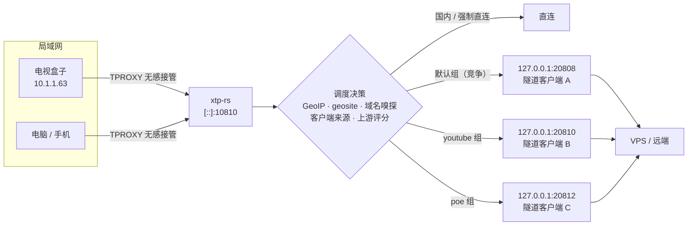
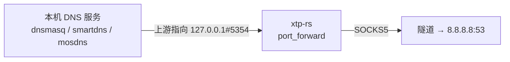
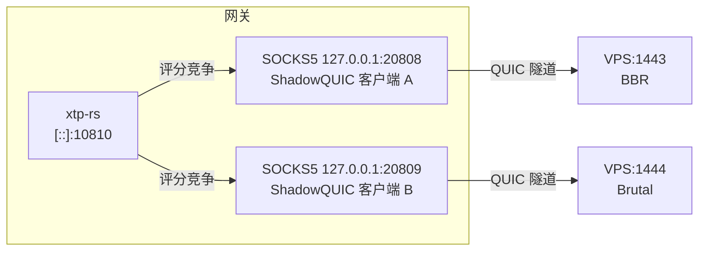
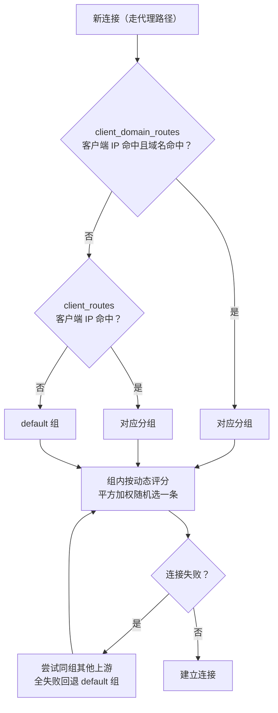

# xtp-rs 实战教程：从透明代理到多上游竞争

> 一份由浅入深的 xtp-rs 使用指南：从「能跑起来」到「让网关自己思考」。
>
> 读完你将掌握：TPROXY 透明代理、GeoIP / geosite 分流、域名嗅探、DNS 转发、多上游动态竞争（BBR vs Brutal）、YouTube / Poe 专属线路、IPv4/IPv6 双栈全覆盖。

## 目录

- [第 1 章 xtp-rs 是什么](#第-1-章-xtp-rs-是什么)
- [第 2 章 十分钟跑起来](#第-2-章-十分钟跑起来)
- [第 3 章 分流三件套：GeoIP、geosite 与强制规则](#第-3-章-分流三件套geoipgeosite-与强制规则)
- [第 4 章 域名嗅探：让域名规则真正生效](#第-4-章-域名嗅探让域名规则真正生效)
- [第 5 章 DNS over SOCKS5：端口转发](#第-5-章-dns-over-socks5端口转发)
- [第 6 章 多上游竞争上岗：BBR vs Brutal](#第-6-章-多上游竞争上岗bbr-vs-brutal)
- [第 7 章 分组路由：给业务划专线](#第-7-章-分组路由给业务划专线)
- [第 8 章 IPv4 / IPv6 双栈全覆盖](#第-8-章-ipv4--ipv6-双栈全覆盖)
- [第 9 章 运维与调优](#第-9-章-运维与调优)
- [第 10 章 毕业设计：一份生产配置全解剖](#第-10-章-毕业设计一份生产配置全解剖)
- [第 11 章 排障 FAQ](#第-11-章-排障-faq)
- [结语：xtp-rs 的思维层级](#结语xtp-rs的思维层级)

---

## 第 1 章 xtp-rs 是什么

### 1.1 一句话定位

xtp-rs 是一个跑在网关（路由器 / 旁路由 / 软路由）上的 **TPROXY 透明代理与流量调度器**。它把局域网设备的 TCP/UDP 流量无感接管过来，根据 **IP 归属地、geosite 域名分类、嗅探到的域名、客户端来源、上游实时质量** 决定每一股流量：直连，还是交给某个 SOCKS5 上游。

它 **不实现任何翻墙协议**。协议层（ShadowQUIC、TUIC、Hysteria、Xray、sing-box……）交给专业工具，这些工具在本机暴露标准 SOCKS5 端口，xtp-rs 只负责「指挥交通」：



### 1.2 为什么不用 xray / sing-box 一把梭

xray、sing-box 也能做透明代理和分流，但 xtp-rs 补上了它们不擅长的两件事：

1. **多上游实时竞争**——基于 TCP_INFO 吞吐量和 QUIC 探针（RTT / 丢包 / MTU）给每条隧道动态打分，平方加权随机选路。网络好时选斯文线路，高丢包时自动掀桌换拼命线路（第 6 章）。
2. **按「客户端 + 域名」划专线**——电视盒子的 YouTube 走 A 机房，电脑的 Poe 走 B 机房，其余流量走默认竞争池，全部在一台网关上一个进程内完成（第 7、8 章）。

分工哲学：**隧道客户端负责「能出去」，xtp-rs 负责「走哪条出去最划算」**。

---

## 第 2 章 十分钟跑起来

### 2.1 安装

- **预编译二进制**：GitHub Releases 提供 x86_64 / aarch64 / armv7 / mips(el) 等多平台构建（含 musl 静态版，适合 OpenWrt）。
- **源码编译**：Rust 1.85+，`cargo build --release` 即可。

### 2.2 部署透明代理环境

```bash
cd contrib/usr/libexec/xtp-rs
sudo ./setup-xtp-rs.sh     # 配置 nftables + 策略路由（IPv4/IPv6 都会处理）
```

脚本做的事（`common.sh` 里的三个常量，记住它们）：

| 常量 | 默认值 | 作用 |
|------|--------|------|
| `XTP_TPROXY_PORT` | `10810` | TPROXY 监听端口，须与配置 `listen` 一致 |
| `XTP_FWMARK` | `1` | nftables 给「待代理」流量打的标记 |
| `XTP_BYPASS_MARK` | `2` | xtp-rs 自身出站连接的标记，nftables 见 2 放行，**防环路** |

### 2.3 最小配置

```toml
# /etc/xtp-rs/config.toml
listen = "[::]:10810"
fwmark = 2                     # 旧版本字段名为 direct_fwmark，含义相同
mmdb_path = "/etc/xtp-rs/Country-only-cn-private.mmdb"

[[upstream]]
id = "proxy_1"
addr = "127.0.0.1:20808"       # 你的隧道客户端暴露的 SOCKS5
```

> [!IMPORTANT]
> **fwmark 必须等于脚本的 `XTP_BYPASS_MARK`（默认 2）**。xtp-rs 自己发给上游的连接也出站，如果这个标记不对，它自己的流量会被 TPROXY 再次劫持，形成死循环——表现为「一启动全网断」。
>
> 字段名说明：当前版本叫 `fwmark`，早期版本叫 `direct_fwmark`。配置文件对未知字段是宽容的（静默忽略），而默认值恰好就是 2，所以写哪个都不会出错——但建议按你所用版本的字段名写清楚。

### 2.4 先自检，再启动

```bash
# 类似 sshd -T：校验配置并打印生效值，有错会直接指出来
xtp-rs -T -c /etc/xtp-rs/config.toml

sudo xtp-rs -c /etc/xtp-rs/config.toml
```

### 2.5 验证

局域网任意设备（无需任何代理设置）：

```bash
curl ip.sb            # 应显示 VPS 的 IP（国外站点走代理）
curl -4 ifconfig.co   # 国内站点直连时应显示本地宽带 IP
```

第一步到此就完成了：**能监听、能劫持、能走 SOCKS5、国内不被误代理**。后面的章节都是在给这个最小骨架添肌肉。

---

## 第 3 章 分流三件套：GeoIP、geosite 与强制规则

### 3.1 判定顺序（务必记住这张表）

`smart` 模式下，xtp-rs 按下面的优先级裁决，**命中即返回**：

| 优先级 | 规则 | 配置项 |
|:---:|------|--------|
| 1 | 域名强制规则 | `force_socks5_domains` → `force_direct_domains` |
| 2 | geosite 域名分类 | `proxy_geosite_tags` → `direct_geosite_tags` |
| 3 | 路由缓存 | （只缓存 IP 规则结果，域名规则每次现算） |
| 4 | IP 强制规则 | `force_socks5_ips` → `force_direct_ips` |
| 5 | 本地地址 | `direct_local_ip`（回环 / 链路本地直连） |
| 6 | GeoIP 国家 | `direct_countries`（默认 `["CN"]`） |

两个值得注意的细节：

- **域名规则永远压过 IP 规则**：哪怕一个域名解析到 CN IP，只要它在 `force_socks5_domains` 或 `proxy_geosite_tags` 里，照样走代理。
- **geosite 内部是先 proxy 后 direct**：同一个域名同时命中两边时，代理胜出。所以 `direct_geosite_tags` 要保守，宁可少写。

### 3.2 GeoIP：按 IP 归属地分流

```toml
mmdb_path = "/etc/xtp-rs/Country-only-cn-private.mmdb"
direct_countries = ["CN"]        # 默认值
```

覆盖面最广、零运行时成本的粗筛：CN IP 直连，其余默认代理。缺点是只看 IP 不懂业务——国外服务的国内 CDN、国内服务的境外服务器，它会判反，这时候靠域名层兜底。

### 3.3 geosite：按域名类别分流

```toml
geosite_path = "/usr/local/xray/geosite.dat"

proxy_geosite_tags = [
  "gfw",                # 被封锁的典型站点
  "geolocation-!cn",    # 非中国站点
  "google", "youtube", "twitter",
]

direct_geosite_tags = [
  "geolocation-cn",     # 中国站点
  "private",            # 私有域名
]
```

标签书写有三个「宽容特性」（源码里做了归一化）：

- 大小写不敏感：`"GFW"` 也行；
- `geosite:` 前缀可有可无：`"geosite:gfw"` 与 `"gfw"` 等价；
- 自动去空格。

geosite.dat 与 Xray 社区规则库同源，记得定期更新，过旧的库会误判新站点。

### 3.4 force 规则：你的个人例外清单

geosite 和 GeoIP 是「别人的判断」，force 规则是「你的判断」，优先级最高：

```toml
# 游戏下载走本地 CDN 更快，强制直连
force_direct_domains = [
  ".dl.playstation.net",
  ".steamserver.net",
]

# 某个解析到 CN IP 但必须先代理的站点
force_socks5_domains = [".example.com"]
```

域名写法两种：

| 写法 | 含义 |
|------|------|
| `.example.com` | 后缀匹配：`example.com` 及其所有子域名 |
| `example.com` | 精确匹配：仅 `example.com` 本身 |

IP 版本同理：`force_direct_ips` / `force_socks5_ips` 支持 CIDR，量大时可放文件里用 `force_direct_ips_file` / `force_socks5_ips_file` 引入（每行一条）。

> [!TIP]
> 什么时候用 force 而不是改 geosite？——**你的个人偏好**（游戏平台直连、某站必代理）用 force；**公共性的分类错误**应该去更新 geosite 规则库。force 清单越长越难维护，每条都建议写注释说明为什么存在。

---

## 第 4 章 域名嗅探：让域名规则真正生效

### 4.1 为什么需要嗅探

透明代理接到的流量，天生只有「目标 IP:端口」，没有域名。而上一章的域名规则（geosite、force、以及第 7 章的专线分组）全都依赖域名。嗅探（sniff）就是从流量的第一个包里把域名「偷看」出来：

| 嗅探 | 协议 | 从哪提取域名 |
|------|------|--------------|
| `sniff_tls_sni` | TCP | TLS ClientHello 的 SNI 字段（HTTPS） |
| `sniff_http_host` | TCP | HTTP/1.x 请求头的 Host 字段（明文 HTTP） |
| `sniff_quic_sni` | UDP | QUIC Initial 包里的 SNI（HTTP/3） |

**默认全部关闭**，需要显式打开：

```toml
sniff_tls_sni = true
sniff_http_host = true
sniff_quic_sni = true
tls_sniff_peek_len = 4096    # ClientHello 较大时更稳妥（默认 2048）
```

运行时开销很小：只对「非直连」流量的**首包**做一次解析，之后的包零成本。

### 4.2 什么时候才会触发嗅探

不是每条连接都嗅探。满足以下**任一**条件才启动（仅针对代理路径上的流量，直连流量永远不嗅探）：

1. 配置了域名强制规则（`force_direct_domains` / `force_socks5_domains` 非空）；
2. 配置了 geosite 且处于 `smart` 模式；
3. 配置了 `client_domain_routes`，且当前客户端 IP 命中其中的条目。

第 3 条到第 7 章会变得重要：你给电视盒子配了 YouTube 专线，盒子的连接就会触发嗅探，从而拿到域名去匹配 `.googlevideo.com`。

### 4.3 TCP 与 UDP 嗅探的关键差异（高级）

- **TCP 嗅探**参与「直连 / 代理」决策：拿到域名后重新过一遍 geosite / force 规则，可以把 IP 层的误判纠正过来。
- **UDP 嗅探只影响「走哪个上游分组」**，不影响直连 / 代理。UDP 的直连判定永远基于 IP-only 结果。

所以 YouTube 这种 QUIC 大户必须开 `sniff_quic_sni`：TCP 443 走 TLS 嗅探能进 youtube 组，UDP 443（HTTP/3）要靠 QUIC 嗅探才能进同一个组。不开的话，同一个视频的 TCP 走专线、QUIC 走默认池，体验割裂。

### 4.4 QUIC 嗅探的两种模式

```toml
quic_sniff_forward_first = true   # 默认值
```

- `true`（默认）：**首包先转发**（不带域名，按默认分组），后台异步解析，解析出域名后后续包用新分组。优点：首包零延迟。
- `false`：**缓存首包等嗅探完成**再转发。优点：第一个包就进对组；缺点：首包增加一点延迟。

看视频场景首包晚几十毫秒无所谓、但进错组可能卡缓冲，在意的话可以用 `false`。

---

## 第 5 章 DNS over SOCKS5：端口转发

### 5.1 解决什么问题

`[[port_forward]]` 在本地起一个 TCP/UDP 端口，把收到的数据**无条件**经 SOCKS5 转发到固定目标。最经典的用途是 DNS：

```toml
[[port_forward]]
name = "dns-google"
bind = "127.0.0.1:5354"
remote = "8.8.8.8:53"
network = "both"        # tcp / udp / both
```



DNS 查询从隧道出去，在远端解析，**本地运营商的 DNS 污染够不着你**。

### 5.2 两个常见误会

1. **port forward ≠ 自动接管所有 DNS**。它只是建了一条「本地端口 → 远端」的显式通道。要让局域网设备用上它，得在你的 DNS 服务（dnsmasq / smartdns / mosdns / AdGuard Home）里把上游指到 `127.0.0.1#5354`。
2. **它不是 sniff 的替代品**。DNS 解析结果正确，不等于连接会走对路——连接走哪条路，由前几章的分流规则决定。DNS 干净 + 分流正确，两件事都要做。

### 5.3 验证

```bash
dig @127.0.0.1 -p 5354 google.com +short      # UDP
dig @127.0.0.1 -p 5354 google.com +short +tcp # TCP
```

能拿到结果即通道正常；拿到被污染的结果（如 31.13.x.x 之类的黑洞 IP）说明没走隧道，检查 SOCKS5 上游。

---

## 第 6 章 多上游竞争上岗：BBR vs Brutal

> 本章是全套架构的性能核心，配套实战环境：ShadowQUIC 双隧道 + xtp-rs 动态评分。

### 6.1 为什么需要「竞争」

在高丢包（30%+）的恶劣网络里，不同拥塞控制的表现天差地别：

- **TCP BBR** 会被丢包欺骗，主动降速到几乎归零；
- **Brutal** 无视丢包，按固定速率硬怼，绝境中能抢出数十倍带宽。

但网络不是一成不变的。BBR 在干净网络下延迟更低、更公平；Brutal 只在绝境中才该出场。与其手动切换，不如让两条线路**同时在线、实时竞争**，由 xtp-rs 根据实测吞吐量自动裁决。

### 6.2 架构



### 6.3 服务端：VPS 上的双 ShadowQUIC 实例

BBR 隧道 `/etc/shadowquic/server.yaml`：

```yaml
inbound:
    type: shadowquic
    bind-addr: "[::]:1443"
    users:
        - username: "your_user"
          password: "your_pass"
    jls-upstream:
        addr: "cloudflare.com:443"   # 伪装目标，域名需与客户端一致
    alpn: ["h3"]
    congestion-control: bbr
    zero-rtt: true
    gso: false
outbound:
    type: direct
    dns-strategy: prefer-ipv6
log-level: "info"
```

Brutal 隧道 `/etc/shadowquic/brutal.yaml`（只有端口和拥塞控制不同）：

```yaml
inbound:
    type: shadowquic
    bind-addr: "[::]:1444"
    users:
        - username: "your_user"
          password: "your_pass"
    jls-upstream:
        addr: "cloudflare.com:443"
    alpn: ["h3"]
    congestion-control:
      brutal:
        bandwidth: 45M             # 固定发送速率，按你的实际带宽调整
        cwnd-gain: 1.1
        ack-compensate: true
    zero-rtt: true
    gso: false
outbound:
    type: direct
    dns-strategy: prefer-ipv6
log-level: "info"
```

```bash
shadowquic -c /etc/shadowquic/server.yaml &
shadowquic -c /etc/shadowquic/brutal.yaml  &
```

### 6.4 客户端：网关上跑两个本地 SOCKS5 出口

在跑 xtp-rs 的网关上启动两个 ShadowQUIC 客户端，分别连 VPS 的 1443 / 1444，本地暴露 SOCKS5：

- BBR 隧道 → `127.0.0.1:20808`
- Brutal 隧道 → `127.0.0.1:20809`

启动参数与服务端对应（用户名、密码、伪装域名），详见 ShadowQUIC 文档。先验证两条路都通：

```bash
curl --socks5-hostname 127.0.0.1:20808 https://www.google.com -o /dev/null -w "%{speed_download}\n"
curl --socks5-hostname 127.0.0.1:20809 https://www.google.com -o /dev/null -w "%{speed_download}\n"
```

### 6.5 xtp-rs 配置：把两条路放进同一个组

```toml
# 动态评分总开关（false = 启用评分；true = 完全随机，失去竞争意义）
disable_upstream_score = false

# QUIC 探针（RTT/丢包/MTU）在总分中的权重，默认 70
# 想更倚重真实吞吐表现就调低，例如 40：TCP 吞吐 60% + QUIC 探针 40%
quic_weight = 40

[[upstream]]
id = "bbr_tunnel"
addr = "127.0.0.1:20808"

[[upstream]]
id = "brutal_tunnel"
addr = "127.0.0.1:20809"
```

两个 upstream 都没写 `groups`，自动同属 `default` 组——普通代理流量就在它俩之间竞争。

### 6.6 评分机制内幕

xtp-rs 给每条上游维护一个 0–1000 的动态分，来自两个信息源：

**① TCP 吞吐分（自动）**：通过 `TCP_INFO` 周期统计每条上游 SOCKS5 连接的实际吞吐量，按阶梯映射成分数：

| 实测吞吐 | 得分（约） |
|----------|-----------|
| < 0.1 MiB/s | 0–100 |
| 1 MiB/s | 300 |
| 5 MiB/s | 600 |
| 10 MiB/s | 800 |
| ≥ 50 MiB/s | 1000 |

**② QUIC 探针分（被动接收）**：ShadowQUIC 原生支持将链路质量（RTT、丢包率、MTU）输出到 syslog，无需任何修改。配套的 `xtp-stats-reporter` daemon（`contrib/usr/libexec/xtp-rs/stats_reporter.sh`）实时捕获这些日志，解析后通过本地 Unix 数据报 socket `/tmp/xtp-rs-report.sock` 以 JSON 格式上报给 xtp-rs：

```json
{"upstream_id": "bbr_tunnel", "peer": "vps:1443", "rtt_ms": 152.3, "loss_rate": 0.37, "mtu": 1280, "link": "downlink"}
```

基础分 1000，按丢包率和 RTT 逐级扣分；每 5 秒最多刷新一次，新旧分按 3:7 混合（新数据占七成，响应快又不至于抖动）。`loss_rate` 是小数（0.37 = 37%）；`link` 可标 `downlink` / 上行，双向都有报告时取平均。

**合成与选择**：

- 两路信息都有效时：`总分 = TCP分 × (100-quic_weight)% + QUIC分 × quic_weight%`；只有一路有效就用那一路；都没有按 500 处理。
- 每条新连接做 **平方加权随机**：权重 = 分²。例如 BBR 800 分、Brutal 400 分，选中概率 800²:400² = **80% : 20%**——强者通吃大部分新连接，弱者仍保有少量「探测流量」以便网络恢复时能重新涨分。
- 连接失败的上游会被**惩罚**到 100 分，基本出局，直到健康检查或新流量把它捞回来。
- `gain` 是乘在总分上的系数（默认 1.0）：`有效分 = 总分 × gain`。想打压某条上游就调它，而不是改别的。

**调优参数**：

| 参数 | 默认 | 说明 |
|------|------|------|
| `disable_upstream_score` | `false` | true 则完全随机，竞争失效 |
| `quic_weight` | `70` | QUIC 探针权重；大流量场景调低到 40 左右更倚重实测吞吐 |
| `upstream_switch_tolerance` | `0` | 粘性切换容忍度：>0 时，挑战者分数必须超过现任 + tolerance 才换帅，避免两条路分数接近时来回横跳 |
| `gain`（upstream 级） | `1.0` | 单条上游的分数乘数 |

```toml
# 例：Brutal 流量贵，只在碾压 BBR 时才用它
[[upstream]]
id = "brutal_tunnel"
addr = "127.0.0.1:20809"
gain = 0.5
```

> [!NOTE]
> **竞争以「新连接」为单位**。已经开始的大下载不会中途搬家；重新下载、刷新视频、打开新页面时才按最新评分选路。所以验证竞争效果要用新发起的流量，而不是盯着一条旧连接。

### 6.7 健康检查：故障自动隔离

```toml
health_check_interval_secs = 30
health_check_timeout_secs = 5
health_check_fail_threshold = 2
health_check_url = "cp.cloudflare.com"
```

每条上游周期发起 HTTP HEAD 探测，连续失败 2 次标记为不可用、移出竞争池；恢复后自动归队。和被动评分（吞吐 + 探针）互补：被动机制发现「变慢」，主动检查发现「挂了」。

### 6.8 实测效果

环境：37% 丢包，RackNerd VPS，ShadowQUIC 隧道：

| 方案 | 实际速度 |
|------|----------|
| 单独 BBR 隧道 | ~50 KB/s（0.4 Mbps） |
| 单独 Brutal 隧道 | ~20 Mbps |
| **xtp-rs 双路竞争** | **~20 Mbps（自动选中 Brutal）** |

**提升约 400 倍**，且网络恢复后流量自动回流 BBR，全程零干预。

### 6.9 为什么不干脆只用 Brutal

低丢包时 Brutal 的饱和发送会带来额外延迟和抖动，对同网络其他设备不友好，还可能触发运营商的异常流量策略。保留 BBR 接管日常，Brutal 只在绝境翻盘——**让工具替你决定什么时候该礼貌，什么时候该拼命**。

---

## 第 7 章 分组路由：给业务划专线

### 7.1 groups：把上游编成小队

```toml
[[upstream]]
id = "vultr"
addr = "127.0.0.1:20808"          # 没写 groups → 自动属于 default 组

[[upstream]]
id = "vmshell"
addr = "127.0.0.1:20810"
groups = ["youtube"]               # 只属于 youtube 组

[[upstream]]
id = "vmshell_1444"
addr = "127.0.0.1:20811"
groups = ["youtube"]
```

- 一个 upstream 可以属于多个组：`groups = ["youtube", "default"]`；
- 组内多条上游自动按第 6 章的评分机制竞争——**youtube 组 = 一套独立的 BBR/Brutal 竞争池**，和默认池互不干扰；
- 组里只有一条上游时，它就是固定专线，无竞争可言。

### 7.2 client_domain_routes：按「谁访问 + 访问什么」派单

`groups` 只是建好了候选池，把流量引进池子的是路由规则。最精细的是 `client_domain_routes`：**按客户端源 IP + 目标域名**决定分组：

```toml
[client_domain_routes."10.1.1.63"]     # 电视盒子
".youtube.com"    = "youtube"
".googlevideo.com" = "youtube"
".ytimg.com"      = "youtube"
".poe.com"        = "poe"
```

分组查找的完整顺序：



注意三个前提，缺一个规则就「看着配了却不生效」：

1. **域名从嗅探来**——必须开 `sniff_tls_sni` / `sniff_quic_sni`（见第 4 章），且客户端 IP 命中 `client_domain_routes` 才会触发嗅探；
2. **引用的组必须存在且有 upstream**，启动时 `-T` 自检会报不存在的组；
3. **域名匹配按最长后缀优先**——`.googlevideo.com` 和 `.com` 同时配了，前者赢。

### 7.3 实战一：YouTube 专线

YouTube 的流量绝不只有 `youtube.com`：

| 域名 | 角色 |
|------|------|
| `.youtube.com` | 网页、接口 |
| `.googlevideo.com` | **视频分片、音视频数据（最关键）** |
| `youtubei.googleapis.com` / `youtube.googleapis.com` | 客户端 API、播放器接口 |
| `.ytimg.com` / `.ggpht.com` | 缩略图、静态资源 |
| `.youtu.be` / `.youtube-nocookie.com` | 短链、免 Cookie 嵌入 |
| `.youtubekids.com` / `.youtubegaming.com` 等 | 子品牌站点 |
| `.1e100.net` | Google 基础设施反解域名 |
| `.ipify.org` | 出口 IP 检测（方便验证走没走专线） |

只写 `.youtube.com` 的经典症状是：**网页秒开、视频转圈**——页面走了专线，视频分片（googlevideo）还在默认池里挤。完整清单见第 10 章的毕业配置。

两个客户端条目（10.1.1.63、10.1.1.158）各配一份相同的域名表。TOML 没有锚点语法，重复是不可避免的；如果嫌长，可以把整段生成出来，或者用下一章的 CIDR 技巧合并。

### 7.4 实战二：Poe 专线

```toml
[[upstream]]
id = "niyaou"
addr = "127.0.0.1:20812"
groups = ["poe"]
```

> [!WARNING]
> **只建池子不派单，是最常见的配置错误。** 上面这段只创建了 poe 组，没有任何流量会进去。必须配套路由：
>
> ```toml
> [client_domain_routes."10.1.1.63"]
> ".poe.com" = "poe"
> ```
>
> （哪台设备要用 Poe，就给哪台配上；所有设备都要用，见第 8 章的 CIDR 写法。）

想让 Poe 也有 BBR/Brutal 竞争能力？再加一条上游进 poe 组即可，机制与第 6 章完全相同。

---

## 第 8 章 IPv4 / IPv6 双栈全覆盖

很多「透明代理已成功」的部署其实只代理了 IPv4。双栈环境里设备**优先用 IPv6**，于是出现诡异现象：IPv4 走代理一切正常，IPv6 直连失败、泄漏、视频缓冲。双栈要打满三层补丁。

### 8.1 第一层：监听与劫持

- `listen = "[::]:10810"` 双栈监听 ✔
- `setup-xtp-rs.sh` 使用 `inet` 族 nftables 表，并为 IPv6 配置策略路由与本地路由 ✔

这两层用官方脚本就到位了，肉眼验证：`sudo nft list table inet xtp-rs` 里应同时看到 ip / ip6 的匹配规则。

### 8.2 第二层：路由规则也要双栈（最容易漏）

`client_domain_routes` 按**客户端源 IP** 查表。你给电视盒子配的是：

```toml
[client_domain_routes."10.1.1.63"]
".youtube.com" = "youtube"
```

盒子的 **IPv4** 连接源地址是 10.1.1.63 → 命中 → YouTube 走专线 ✔
盒子的 **IPv6** 连接源地址是运营商分的公网地址（比如 2409:8a1e:…:63）→ **查无此人** → 掉进 default 组 ✘

结果就是：同一台电视，v4 看 YouTube 走 vmshell 专线，v6 看 YouTube 挤默认池——而 YouTube 恰恰优先 v6，于是你以为配了专线其实大部分时间没走。

### 8.3 解法：用运营商大段一把罩住所有 IPv6 客户端

`client_domain_routes` 的键支持任意 **IP/CIDR（v4 或 v6）**，按最长前缀匹配。家庭宽带下，所有设备的公网 v6 都落在运营商分配的前缀段内，所以：

```toml
# 中国移动宽带：所有设备的公网 v6 都在 2409::/16 里
[client_domain_routes."2409::/16"]
".youtube.com"     = "youtube"
".googlevideo.com" = "youtube"
".ytimg.com"       = "youtube"
".ggpht.com"       = "youtube"
".poe.com"         = "poe"
# ……（与 v4 条目同一份域名表）
```

三大运营商的 IPv6 大段：

| 运营商 | 前缀 |
|--------|------|
| 中国移动 | `2409::/16` |
| 中国电信 | `240e::/16` |
| 中国联通 | `2408::/16` |

以你宽带实际分到的为准——在任意一台设备上 `ip -6 addr` 看全球单播地址（GUA）的前几位即可确认。

这招的三个优点：

1. **一劳永逸**：不用再为每台设备枚举 v6 地址；
2. **免疫动态前缀**：PPPoE 重拨换了委派的 /60，设备地址变了，/16 照样罩住；
3. **安全无虞**：TPROXY 只接得到自己网关下的客户端，/16 匹配到的只会是你的设备；想给某台 v6 设备单独开小灶，写更长前缀（/64、/128）即可，**最长前缀永远优先**，大段只是兜底。

### 8.4 第三层：QUIC 嗅探必须开

YouTube / Google 系在 v6 上几乎全是 QUIC（UDP 443）。v6 流量进了 TPROXY、客户端也命中了 2409::/16 之后，还差最后一步——**从 QUIC Initial 里解析出域名**才能匹配 `.googlevideo.com`：

```toml
sniff_quic_sni = true
```

回忆第 4 章：UDP 嗅探不影响直连/代理（那是 IP 层定的），只决定**进哪个分组**——这正是本场景需要的。

### 8.5 双栈验证清单

```bash
# 设备上分别测试 v4 / v6 出口
curl -4 ifconfig.co ; curl -6 ifconfig.co
```

再到 xtp-rs 的 debug 日志里确认：

- 出现 v6 客户端地址（2409:…）和 v6 目标地址；
- v6 的 YouTube 连接命中 `youtube` 组而不是 default；
- UDP/443 的连接也有分组记录。

v6 连接在日志里完全隐身，而设备确实有公网 v6——多半是第一层（nftables / 策略路由）没接住 v6；日志里有 v6 连接但分组不对——就是第二层的键没覆盖到。

---

## 第 9 章 运维与调优

### 9.1 信号控制

| 信号 | 行为 |
|------|------|
| `SIGHUP` | 热重载配置（改了 `log_level`、路由规则不用重启进程） |
| `SIGUSR1` | 循环切换代理模式：smart → global → bypass → smart |
| `SIGTERM` / `SIGINT` | 优雅退出 |

```bash
kill -HUP  $(pidof xtp-rs)   # 热重载
kill -USR1 $(pidof xtp-rs)   # 临时切全局/直连排障，按一次换一档
```

热重载注意：端口转发的监听地址变化会关闭旧 socket 再绑新地址，频繁变动可能短暂失败。

### 9.2 日志与自检

```bash
xtp-rs -T -c /etc/xtp-rs/config.toml    # 启动前自检 + 打印生效配置
logread -f | grep xtp-rs                 # OpenWrt（procd 无 journalctl）
```

`log_level = "debug"` + `SIGHUP` 重载后，日志里能看到：每条连接的客户端/目标、嗅探到的域名、命中的规则、被选中的组与上游、实时评分。**排障第一件事永远是开 debug 看日志，而不是猜。**

### 9.3 OpenWrt 集成

`contrib/etc/init.d/xtp-rs` 提供 procd 服务脚本，支持 ujail 沙箱与 capabilities 约束（`contrib/etc/capabilities/xtp-rs.json`），免 root 全权运行：

```bash
/etc/init.d/xtp-rs enable && /etc/init.d/xtp-rs start
```

### 9.3.1 xtp-stats-reporter：ShadowQUIC 性能上报

如果你使用 ShadowQUIC 作为隧道客户端并希望 xtp-rs 能根据 QUIC 链路质量动态选路，需要部署 `xtp-stats-reporter`。ShadowQUIC 原生支持将链路质量输出到 syslog，无需任何修改；xtp-stats-reporter 作为配套 daemon，从 syslog 中实时捕获这些日志（RTT、丢包率、MTU），解析后上报给 xtp-rs。

**安装**：

```bash
cp contrib/etc/init.d/xtp-stats-reporter /etc/init.d/
cp contrib/usr/libexec/xtp-rs/stats_reporter.sh /usr/libexec/xtp-rs/
chmod +x /etc/init.d/xtp-stats-reporter /usr/libexec/xtp-rs/stats_reporter.sh

/etc/init.d/xtp-stats-reporter enable
/etc/init.d/xtp-stats-reporter start
```

**依赖**：`socat`（`opkg install socat`）、`logread`（OpenWrt 自带）。

**验证**：`logread | grep xtp-stats-reporter` 应能看到解析日志；如果 ShadowQUIC 正在运行且链路有流量，xtp-rs 的 debug 日志中会出现 QUIC 探针分数更新。

> [!NOTE]
> 不使用 ShadowQUIC 时无需部署此 daemon。xtp-rs 的 TCP 吞吐评分（基于 `TCP_INFO`）始终自动生效，不依赖任何外部组件。

### 9.4 路由缓存

| 参数 | 默认 | 说明 |
|------|------|------|
| `route_cache_ttl_secs` | `5` | IP 规则结果缓存 TTL，0 关闭 |
| `route_cache_max` | `4096` | 缓存容量 |

域名规则的结果**不缓存**（每次都现算，保证专线规则即时生效），缓存只加速 GeoIP / IP 规则判定。默认参数对家用足够。

### 9.5 性能提示

- `splice = false` 保持默认：内核开了 `ip_forward` 时 splice 零拷贝反而可能掉速；
- 嗅探只处理非直连流量首包，全开的开销可以忽略；QUIC 解析 AES 相对贵一点，低配路由可在分组需求不强时关 `sniff_quic_sni`；
- UDP 会话超时 `udp_session_timeout_secs`（默认 60s）对 QUIC 长连接足够。

---

## 第 10 章 毕业设计：一份生产配置全解剖

以下是一份真实网关（N6000 软路由）的完整配置，把前面所有章节串起来。逐段注释：

```toml
# ═══════════ 基础 ═══════════
listen = "[::]:10810"          # 双栈监听（第 8.1 节）
fwmark = 2                     # = XTP_BYPASS_MARK，防环路（第 2.3 节；旧版本字段名 direct_fwmark）
mmdb_path = "/etc/xtp-rs/Country-only-cn-private.mmdb"
log_level = "debug"            # 调试期 debug，稳定后改回 info
splice = false                 # 保持默认（第 9.5 节）

# ═══════════ 分流：geosite + GeoIP（第 3 章）═══════════
geosite_path = "/usr/local/xray/geosite.dat"
proxy_geosite_tags  = ["gfw", "geolocation-!cn", "twitter", "google", "google-play", "youtube"]
direct_geosite_tags = ["geolocation-cn", "private"]

# 游戏下载强制直连（第 3.4 节）
force_direct_domains = [".dl.playstation.net", ".steamserver.net"]

# ═══════════ 嗅探（第 4 章）═══════════
sniff_tls_sni  = true
sniff_http_host = true
sniff_quic_sni = true          # YouTube QUIC 分组的关键（第 8.4 节）
tls_sniff_peek_len = 4096

# ═══════════ 动态竞争（第 6 章）═══════════
disable_upstream_score = false
# quic_weight = 40             # 默认 70；想更倚重实测吞吐再打开
# upstream_switch_tolerance = 100   # 分数接近时防横跳，按需

# ── default 组：普通国外流量，Vultr BBR/Brutal 竞争 ──
[[upstream]]
id = "vultr"
addr = "127.0.0.1:20808"

[[upstream]]
id = "vultr_1444"
addr = "127.0.0.1:20809"

# ── youtube 组：VMShell 专线，同样 BBR/Brutal 竞争 ──
[[upstream]]
id = "vmshell"
addr = "127.0.0.1:20810"
groups = ["youtube"]

[[upstream]]
id = "vmshell_1444"
addr = "127.0.0.1:20811"
groups = ["youtube"]

# ── poe 组：单上游固定专线 ──
[[upstream]]
id = "niyaou"
addr = "127.0.0.1:20812"
groups = ["poe"]

# ═══════════ DNS over SOCKS5（第 5 章）═══════════
[[port_forward]]
name = "dns-via-socks5"
bind = "127.0.0.1:5353"
remote = "8.8.8.8:53"
network = "udp"

# ═══════════ 客户端专线路由（第 7 章）═══════════
# —— 电视盒子 10.1.1.63（IPv4 身份）——
[client_domain_routes."10.1.1.63"]
".youtube.com" = "youtube"
".googlevideo.com" = "youtube"
"youtubei.googleapis.com" = "youtube"
"youtube.googleapis.com" = "youtube"
".youtu.be" = "youtube"
".youtube-nocookie.com" = "youtube"
"youtubeembeddedplayer.googleapis.com" = "youtube"
".withyoutube.com" = "youtube"
".youtubekids.com" = "youtube"
".youtubegaming.com" = "youtube"
".youtubefanfest.com" = "youtube"
".youtubeeducation.com" = "youtube"
".ytimg.com" = "youtube"
".ggpht.com" = "youtube"
".1e100.net" = "youtube"
".ipify.org" = "youtube"
".poe.com" = "poe"

# —— 手机 10.1.1.158（IPv4 身份）——
[client_domain_routes."10.1.1.158"]
".youtube.com" = "youtube"
".googlevideo.com" = "youtube"
"youtubei.googleapis.com" = "youtube"
"youtube.googleapis.com" = "youtube"
".youtu.be" = "youtube"
".youtube-nocookie.com" = "youtube"
"youtubeembeddedplayer.googleapis.com" = "youtube"
".withyoutube.com" = "youtube"
".youtubekids.com" = "youtube"
".youtubegaming.com" = "youtube"
".youtubefanfest.com" = "youtube"
".youtubeeducation.com" = "youtube"
".ytimg.com" = "youtube"
".ggpht.com" = "youtube"
".1e100.net" = "youtube"
".poe.com" = "poe"

# —— 所有设备的 IPv6 身份（第 8.3 节，按你的运营商选大段）——
[client_domain_routes."2409::/16"]       # 中国移动；电信 240e::/16，联通 2408::/16
".youtube.com" = "youtube"
".googlevideo.com" = "youtube"
"youtubei.googleapis.com" = "youtube"
"youtube.googleapis.com" = "youtube"
".youtu.be" = "youtube"
".youtube-nocookie.com" = "youtube"
"youtubeembeddedplayer.googleapis.com" = "youtube"
".withyoutube.com" = "youtube"
".youtubekids.com" = "youtube"
".youtubegaming.com" = "youtube"
".youtubefanfest.com" = "youtube"
".youtubeeducation.com" = "youtube"
".ytimg.com" = "youtube"
".ggpht.com" = "youtube"
".1e100.net" = "youtube"
".poe.com" = "poe"
```

启动前 `xtp-rs -T` 自检，通过后上线。

---

## 第 11 章 排障 FAQ

**Q1：YouTube 网页能开，视频疯狂缓冲？**
按序查：① 域名表有没有 `.googlevideo.com`；② `sniff_quic_sni` 开没开；③ 设备的 **IPv6** 连接是否命中规则（第 8 章，2409::/16 配没配）；④ debug 日志里视频连接进的是不是 `youtube` 组。

**Q2：Poe 没走 niyaou 专线？**
九成是只建了 `groups = ["poe"]` 却没配 `".poe.com" = "poe"` 路由——**池子 ≠ 派单**（第 7.4 节）。另外确认访问 Poe 的客户端 IP 命中了某条 `client_domain_routes`。

**Q3：Brutal 明明更快，评分却不选它？**
- 评分靠真实流量喂养：小网页短连接看不出吞吐差异，用大文件下载 / 4K 视频验证；
- 旧连接不迁移，只有新连接按最新分选路；
- `gain` 是不是压太低了；
- `upstream_switch_tolerance` 设了较大的值，分差没超过门槛不换帅。

**Q4：IPv4 一切正常，IPv6 全不通？**
查链：设备有公网 v6 → 网关 v6 默认路由正常 → nftables 有 ip6 规则 → 策略路由有 ip6 规则 → 日志出现 v6 目标 → DNS 返回 AAAA。断在哪层修哪层。

**Q5：一启动 xtp-rs 全网断？**
环路了。`fwmark` 必须等于脚本的 `XTP_BYPASS_MARK`（默认 2），且 ≠ nftables 打标用的 `XTP_FWMARK`（1）。

**Q6：怎么确认某条连接走了哪个上游？**
`log_level = "debug"` + `SIGHUP`，日志输出每次选择的组、上游和评分。

**Q7：quic_weight 调多少合适？**
默认 70 偏链路质量；大流量下载 / 视频场景建议 40 左右，让实测吞吐主导；玩实时游戏在意 RTT 可以拉高。

---

## 结语：xtp-rs的思维层级

| 层级 | 要解决的问题 | xtp-rs 的武器 |
|:---:|--------------|----------------|
| 1 | 设备零配置上网 | TPROXY 透明代理 |
| 2 | 国内直连、国外代理 | GeoIP MMDB + geosite |
| 3 | 按域名精准识别 | TLS / HTTP / QUIC 嗅探 |
| 4 | 业务划专线 | `groups` + `client_domain_routes` |
| 5 | 线路自动优胜劣汰 | 多上游动态评分 + 平方加权随机 |
| 6 | v4/v6/TCP/UDP 都不漏 | 双栈劫持 + v6 CIDR 客户端路由 + QUIC 嗅探 |
| 7 | DNS、游戏特殊处理 | `port_forward` + `force_direct_domains` |
| 8 | 无人值守 | 健康检查、热重载、信号、procd |

最终你的网关不再是一个「固定出口」的代理，而是一套按 **业务、客户端、协议、实时网络质量** 做决策的调度系统：普通流量在默认池里 BBR/Brutal 竞争，YouTube 在专线池里竞争，Poe 走固定专线，国内直连，游戏直连，DNS 走隧道——网络好时斯文，绝境时拼命，全自动。

> 欢迎到 [GitHub 仓库](https://github.com/hrimfaxi/xtp-rs)提交 Issue 和 PR。
